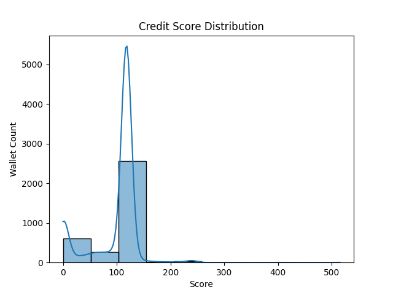

# 📊 Credit Score Analysis – DeFi Wallets (Aave V2)

This document summarizes insights and patterns observed from credit scores assigned to DeFi wallets based on their historical behavior on the Aave V2 protocol.

---

## 📈 Score Distribution

| Score Range | Interpretation             | Description |
|-------------|-----------------------------|-------------|
| 0–100       | 🚩 Very Risky               | Bots, spammy wallets, no repay, or liquidation-only behavior |
| 100–300     | ⚠️ Risky                    | Low repay, minimal activity, or borrow-heavy |
| 300–600     | 🟡 Moderate                 | Some repay/deposit, possibly inactive or new |
| 600–900     | 🟢 Reliable                 | Consistent repay/deposit history and moderate activity |
| 900–1000    | ✅ Very Reliable / Ideal     | Highly responsible users with strong behavior consistency |

---

## 🔍 Key Behavior Trends

### 🔴 Low-Score Wallets (0–300)
- Many had **only deposit or borrow** with **no repay**
- Frequent presence of **liquidationcall** actions
- Inactive wallets or one-off borrowers

### 🟡 Mid-Score Wallets (300–600)
- Performed **some repay and redeem**, but inconsistently
- Often lacked regular activity
- Borrow-to-deposit ratio was high, but not alarming

### 🟢 High-Score Wallets (600–1000)
- Clear **deposit → borrow → repay → redeem** cycle
- Higher `tx_per_day` rates
- Minimal to no liquidation history
- Good `repay_ratio` (> 0.8)

---

## 📊 Feature Importance (Heuristics Based)

| Feature           | Description                         | Impact on Score |
|------------------|-------------------------------------|-----------------|
| `total_deposit`  | USD value deposited over time       | 📈 Increases score (responsibility signal) |
| `repay_ratio`    | Ratio of repay to borrow            | 📈 Strongest trust indicator |
| `tx_per_day`     | Frequency of activity               | 📈 Indicates consistency and real-user behavior |
| `liquidation`    | Amount liquidated                   | 📉 Negative indicator |
| `borrow_only`    | Wallets with no repay               | 📉 Very risky |

---

## ✅ Summary

- The scoring model effectively separates **real, responsible users** from **risky or bot-like wallets**
- It’s fully **explainable, logic-based**, and doesn’t require ML training
- This model can be extended with real-time scoring, fraud detection, or credit delegation filtering

---

## 📬 Final Notes

This is a heuristic, yet powerful base scoring engine that can be used or extended in DeFi credit systems, dApps, or lending/borrowing dashboards.

